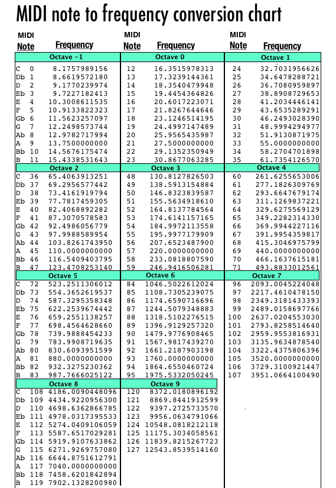

# guitar

Review:
https://code.visualstudio.com/docs/languages/markdown
Control+Shift+V to view images in this markdown
Ctrl+K V to view split side-by-side

## Debugging Chrome
From Chrome -  Control+Shift+I

in .json write:
console.log("hello!");

Once we delve into Angular things there will be better debugging tools. For now learn the ones included with Chrome.

## Things to do
### Steve Vai Chord studies
Invert and Arpegiate different chords, like GMaj7
Use Midi notes to store chord information. That way we can do different things with it later:

### Look at Python library Mingus for ideas:
https://github.com/bspaans/python-mingus/
If you don't have Python, I recommend -- https://www.anaconda.com/download/

### Learn d3.
Try to make a single line representing a guitar string.
put a dot on that line representing a note.

## Stuff to learn from 
Javascript Reference. Good place to get started:
https://app.pluralsight.com/player?course=js4cs&author=shawn-wildermuth&name=js4cs-m1-basics&clip=0&mode=live

and:
https://app.pluralsight.com/library/courses/javascript-fundamentals-es6/table-of-contents

For HTML:
https://app.pluralsight.com/library/courses/front-end-web-app-html5-javascript-css/table-of-contents

